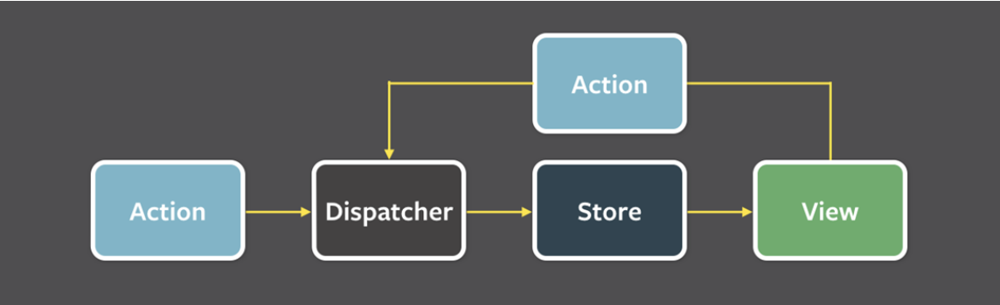

# flux 패턴

flux 패턴은 단방향으로 데이터 흐름을 관리하는 디자인 패턴이다.
모델과 뷰의 관계가 복잡해지며, 뷰에서 일어난 것이 모델에 영향을 끼치기도 하고 그 반대도 영향을 미치기도 하며 데이터를 일관성 있게 뷰에 공유하기 어려워졌다. 때문에 데이터가 '한방향'으로만 흐르게 flux 패턴이 등장했다.

## flux 패턴의 구조

### Action

사용자의 이벤트를 담당하며 마우스 클릭이나 글을 쓴다던가 등의 이벤트에 대한 객체를 만들어 dispather에게 전달한다.

### Dispatcher

모든 데이터는 중앙 허브인 dispatcher를 통해 흐른다. Dispatcher는 들어오는 Action 객체 정보를 기반하여 어떠한 행위를 한 것인가를 결정한다. 보통 action 객체의 type을 기반으로 미리 만들어 놓은 로직을 수행하고 이를 store에 전달한다.

### Store

스토어는 애플리케이션 상태를 관리하고 저장하는 계층이다. 도메인의 상태, 사용자의 인터페이스 등의 상태를 모두 저장한다.

### View

데이터를 기반으로 표출이 되는 사용자 인터페이스. view는 사용자의 상호작용에 응답하기 위해 새로운 action을 만들어 시스템에 전파한다.

### flux패턴의 순서

1. view는 사용자의 상호작용에 응답하기 위해 새로운 action을 만들어 시스템에 전파
2. 모든 데이터는 중앙 허브인 dispatcher를 통해 흐른다.
3. action은 dispatcher에게 action creator 메소드를 제공한다.
4. 대부분의 action은 view에서의 사용자 상호작용에서 발생한다.
5. dispatcher는 store를 등록하기 위해 콜백을 실행한 이후에 action을 모든 store로 전달
6. 등록된 콜백을 활용해 store는 관리하고 있는 상태 중 어떤 액션이라도 관련이 있다면 전달해준다.
7. store는 change 이벤트를 controller-views에게 알려주고 그 결과로 데이터 계층에서의 변화가 일어난다.
8. Controller-views는 이 이벤트를 듣고 있다가 이벤트 핸들러가 있는 store에서 데이터를 다시 가져온다.
9. controller-views는 스스로의 setState() 메소드를 호출하고 컴포넌트 트리에 속해 있는 자식 노드 모두를 다시 랜더링하게 한다.
10. Action creator는 라이브러리에서 제공하는 도움 메소드로 메소드 파라미터에서 action을 생성하고 type 을 설정하거나 dispatcher에게 제공하는 역할을 한다.
11. 모든 action은 store가 dispatcher에 등록해둔 callback을 통해 모든 store에 전송된다.
12. action에 대한 응답으로 store가 스스로 갱신을 한 다음에는 자신이 변경되었다고 모두에게 알린다.
13. controller-view라고 불리는 특별한 view가 변경 이벤트를 듣고 새로운 데이터를 store에서 가져온 후 모든 트리에 있는 자식 view에게 새로운 데이터를 제공한다.

> https://haruair.github.io/flux/docs/overview.html

### flux 패턴의 장점

- 데이터 일관성의 증대
- 버그를 찾기가 쉬워짐
- 단위테스팅이 쉬워짐

# 전략패턴과 의존성 주입의 차이

## 전략패턴

- 알고리즘이나 로직을 클래스 계층으로 캡슐화하여 런타임에 동적으로 교체할 수 있도록 한다.
- 특정 기능을 구현하는 여러 알고리즘을 정의하고 클라이언트의 필요에 따라 알고리즘을 선택할 수 있게 한다.

## 의존성 주입

- 객체 간의 의존성을 주입하여 코드의 결합도를 낮추고 테스트 가능성을 높인다.
- 객체의 생성 및 초기화를 외부에서 관리하여 유연하고 확장 가능한 설계를 가능하게 한다.

## 공통점

어떤 것을 쉽게 교체하기 위한 디자인 패턴

# 컨텍스트란 : 문맥, 환경, 정황

## 컨텍스트란?

1. 어떤 종류의 상태, 환경을 캡슐화한 것을 말함
2. 작업이 중단 되고 나중에 같은 지점에서 계속 될 수 있도록 저장하는 최소 데이터 집합
