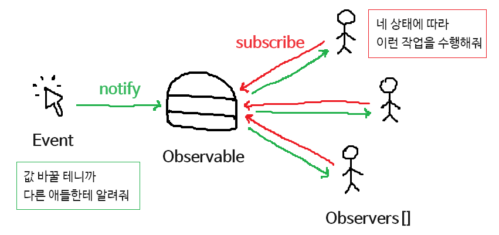

# 옵저버 패턴 (Observer Pattern)



옵저버 패턴은 옵저버들이 관찰하고 있는 대상자의 상태가 변화가 있을 때마다 대상자는 직접 목록의 각 관찰자들에게 통지하고, 관찰자들은 알림을 받아 조치를 취하는 행동 패턴이다. 옵저버 패턴은 일대다 의존성을 가지는데, 주로 분산 이벤트 핸들링 시스템을 구현하는 데 사용된다. Pub/Sub(발행/구독) 모델로도 알려져 있기도 하다.

Ex) youtube의 구독:

구독한 사람들에게는 유튜버의 영상 알림이 가지만, 구독하지 않은 사람들에게는 알림이 가지 않는다.
프로그래밍적으로 옵저버 패턴은 갱신을 위한 힌트 정보를 전달받길 기다린다고 보는 것이 적절하다.

## 옵저버패턴 예시 코드

```js
// Subject: 상태를 가지고 있고, 옵저버를 관리
class Subject {
  constructor() {
    this.observers = []; // 옵저버(구독자) 목록
    this.state = null; // Subject의 상태
  }

  // 옵저버 추가 (구독)
  addObserver(observer) {
    this.observers.push(observer);
  }

  // 옵저버 제거 (구독 취소)
  removeObserver(observer) {
    this.observers = this.observers.filter(obs => obs !== observer);
  }

  // 상태 변경 및 옵저버들에게 알림
  setState(newState) {
    console.log(`Subject: 상태를 ${newState}로 변경했습니다.`);
    this.state = newState;
    this.notifyObservers(); // 모든 옵저버에게 알림
  }

  // 옵저버들에게 알림 전달
  notifyObservers() {
    this.observers.forEach(observer => observer.update(this.state));
  }
}

// Observer: Subject의 상태 변화를 감지하고 행동
class Observer {
  constructor(name) {
    this.name = name;
  }

  // 상태 변화에 따라 동작
  update(state) {
    console.log(`${this.name}: Subject 상태가 ${state}로 변경되었습니다.`);
  }
}

// 사용 예시
const subject = new Subject();

// 옵저버 생성
const observer1 = new Observer('Observer 1');
const observer2 = new Observer('Observer 2');

// 옵저버를 Subject에 등록 (구독)
subject.addObserver(observer1);
subject.addObserver(observer2);

// Subject 상태 변경
subject.setState('ON');
subject.setState('OFF');

// 옵저버 제거
subject.removeObserver(observer1);
subject.setState('IDLE');
```

## 옵저버패턴 구조

- ISubject: 관찰 대상자를 정의하는 인터페이스
- ConcreteSubject: 관찰 당하는 대상자/발행자/게시자
  - 옵저버들을 리스트로 모아 합성하여 가지고 있음
  - subject는 Observer들을 내부 리스트에 등록/삭제하는 인프라를 가지고 있음.
  - subject가 상태를 변경하거나 어떤 동작을 실행할 때, observer들에게 알림 발행.
- IObserver: 구독자들을 묶는 인터페이스
- Observer: 관찰자/구독자/알림 수신자
  - observer들은 subject가 발행한 알림에 대해 현재 상태 취득
  - subject의 업데이트에 대해 전후 정보 처리

핵심은 합성한 객체를 리스트로 관리하고, 리스트에 있는 관찰자 객체들에게 모두 메서드 위임을 통한 전파 행위를 한다는 점이다.

## 옵저버 패턴의 장단점

#### 장점

- Subject의 상태 변경을 자동으로 감지함.
- 발행자의 코드를 변경하지 않고 새 구독자 클래스를 도입할 수 있어 개방 폐쇄 원칙 준수함.
- 런타입 시점에서 발행자와 구독 알림 관계를 맺을 수 있음.
- 상태를 변경하는 객체와 변경을 감지하는 객체의 관계를 느슨하게 유지할 수 있음.

#### 단점

- 구독자는 알림 순서를 제어할 수 없고, 무작위 순서로 알림을 받음.
- 옵저버 패턴을 자주 구성하면 구조와 동작을 알아보기 힘들어져 코드 복잡도 증가.
- 다수의 옵저버 객체 등록 후 해지 안하면 메모리 누수 발생 가능성 있음.

# 프록시 패턴 (Proxy Pattern)

프록시 패턴은 대상 원본 객체를 대리하여 대신 처리하게 함으로써 로직의 흐름을 제어하는 행동 패턴이다. 번거롭게 중계 대리자를 통해 이용하는 방식을 취하는 이유는 대상 클래스가 민감한 정보를 가지고 있거나, 인스턴스화 하기에 무겁거나 추가 기능을 가미하고 싶은데 원본 객체를 수정할 수 없는 상황일 때를 극복하기 위해서이다.

프록시 패턴을 사용하면

1. 보안: 프록시는 클라이언트가 작업을 수행할 수 있는 권한이 있는지 확인하고 검사 결과가 긍정적인 경우에만 요청을 대상으로 전달한다.
2. 캐싱: 프록시가 내부 캐시를 유지하여 데이터가 캐시에 아직 존재하지 않는 경우에만 대상에서 작업이 실행되도록 한다.
3. 데이터 유효성 검사: 프록시가 입력을 대상으로 전달하기 전에 유효성을 검사한다.
4. 지연 초기화: 대상의 생성 비용이 비싸다면 프록시는 그것을 필요로 할 때까지 연기할 수 있다.
5. 로깅: 프록시는 메소드 호출과 상대 매개 변수를 인터셉트하고 이를 기록한다.
6. 원격 객체: 프록시는 원격 위치에 있는 객체를 가져와서 로컬처럼 보이게 할 수 있다.
   이러한 효과를 누릴 수 있다.

## 프록시 패턴 종류

- 기본형 프록시
- 가상 프록시: 지연 초기화 방식. 실제 객체의 생성에 많은 자원이 소모되지만 사용 빈도는 낮을 때 쓰는 방식
- 보호 프록시: 프록시가 대상 객체에 대한 자원으로의 엑세스 제어. 특정 클라이언트만 서비스 객체를 사용할 수 있게 하는 경우.
- 로깅 프록시: 대상 객체에 대한 로깅을 추가하려는 경우.
- 원격 프록시: 프록시 클래스는 로컬에 있고, 대상 객체는 원격 서버에 존재하는 경우
- 캐싱 프록시: 데이터가 큰 경우 캐싱하여 재사용 유도. 클라이언트 요청의 결과를 캐시하고 이 캐시의 수명 주기 관리

## 프록시 패턴 사용 시기

- 접근을 제어하거나 기능을 추가하고 싶은데 기존의 특정 객체를 수정할 수 없을 때.
- 초기화 지연, 접근 제어, 로깅, 캐싱 등 기존 객체 동작에 수정 없이 추가하고 싶을 때.

## 프록시 패턴 장단점

#### 장점

- 개방 폐쇄 원칙 준수
- 단일 책임 원칙 준수
- 원래 하려던 기능 수행하며 그외의 부가 작업 수행하는데 유용
- 클라이언트는 객체 신경쓰지 않고 서비스 객체를 제어하거나 생명 주기 관리 가능
- 사용자 입장에서는 프록시 객체나 실제 객체나 사용법이 유사하기 때문에 사용성에 문제되지 않음.

#### 단점

- 많은 프록시 클래스를 도입해야 하므로 코드 복잡도 증가 (자바에서는 동적 프록시 기법으로 해결 가능하긴함.)
- 프록시 클래스 자체에 들어가는 자원 많으면 서비스로부터 응답 늦을 수 있음.

```js
// 원래 객체 (RealSubject)
class RealSubject {
  request() {
    console.log('RealSubject: 실제 작업을 수행합니다.');
  }
}

// 프록시 객체 (Proxy)
class ProxySubject {
  constructor(realSubject) {
    this.realSubject = realSubject; // 원래 객체를 참조
    this.accessGranted = false; // 접근 권한 설정
  }

  grantAccess() {
    console.log('Proxy: 접근 권한이 부여되었습니다.');
    this.accessGranted = true;
  }

  request() {
    if (this.accessGranted) {
      console.log('Proxy: 요청을 실제 객체로 전달합니다.');
      this.realSubject.request(); // 실제 객체로 요청을 위임
    } else {
      console.log('Proxy: 접근 권한이 없어 요청을 처리할 수 없습니다.');
    }
  }
}

// 사용 예시
const realSubject = new RealSubject(); // 실제 객체 생성
const proxy = new ProxySubject(realSubject); // 프록시 객체 생성

// 프록시를 통해 요청 처리
proxy.request(); // 접근 권한이 없으므로 요청이 거부됩니다.

proxy.grantAccess(); // 접근 권한 부여
proxy.request(); // 요청이 실제 객체로 전달됩니다.
```

# MVC, MVP, MVVN

## MVC 패턴

프로그램을 각각의 역할에 따라 Model, View, Controller로 나누어 설계한 패턴

#### Model

- Model은 View에 표시되기 위해 필요한 데이터.
- 비즈니스 로직을 설명하는 클래스의 집합으로 구성된다.
- 어떻게 데이터가 변경되고 조작될 수 있는지에 관한 규칙 정의.

#### View

- UI 구성요소
- Controller로부터 받은 UI 데이터를 표시하는 역할
- MVC 패턴에서의 View는 데이터의 상태 변화를 업데이트 하기 위해 옵저버 패턴을 이용해서 Model을 관찰한다.

#### Controller

- 다가오는 사용자의 요청을 처리하는 역할을 담당
- Model을 통해 받은 데이터를 처리하거나, 결과 값을 View에 반환하는 역할을 함.
- 일반적으로 View와 Model 사이를 중재하는 역할

### MVC 패턴의 처리방식

1. Controller로 사용자의 입력이 들어온다.
2. Controller로 Model을 데이터 업데이트 및 불러오고
3. Model은 해당 데이터를 보여줄 View를 선택해서 화면에 보여준다.

### MVC 패턴의 장점

가장 단순하다.

### MVC 패턴의 단점

Model과 View 사이의 의존성이 발생하며 앱이 커지고 복잡해질 수록 유지보수가 어렵다.

## MVP 패턴

MVC에서 파생된 Model과 View 간의 의존성이 없는 아키텍처 패턴

### Presenter

- View에서 요청한 정보를 Model로 부터 가공해서 View로 전달하는 부분

### MVP 패턴의 처리방식

1. View로 사용자의 입력이 들어온다.
2. View는 Presenter에 작업 요청을 한다.
3. Presenter에서 필요한 데이터를 Model에 요청한다.
4. Model은 Presenter에 필요한 데이터를 응답한다.
5. Presenter는 View에 데이터를 응답한다.
6. View는 Presenter로부터 받은 데이터로 화면에 보여준다.

### MVP 패턴의 단점

- View와 Model이 의존성이 없는 대신 View와 Presenter가 1:1로 강한 의존성을 가지게 된다.

## MVVM 패턴

MVC에서 파생된 Model과 View 간의 의존성뿐만 아니라 Controller와 View 간의 의존성도 고려하여 각 구성 요소가 독립적으로 작성되고 테스트될 수 있도록 설계된 아키텍처 패턴

### MVVM 패턴의 처리방식

1. View에 입력이 들어오면 Command Pattern으로 ViewModel에 명령을 한다.
2. ViewModel은 필요한 데이터를 Model에 요청한다.
3. Model은 ViewModel에 필요한 데이터를 응답한다.
4. ViewModel은 응답 받은 데이터를 가공해서 저장한다.
5. View는 ViewModel과의 Data Binding으로 인해 자동 갱신된다.

### MVVM 패턴의 장점

- Model과 View 사이의 의존성이 없다.
- ViewModel과 View 사이의 의존성이 없다.
- 중복되는 코드를 모듈화 할 수 있다.

### MVVM 패턴의 단점

- ViewModel 설계가 어렵다.
