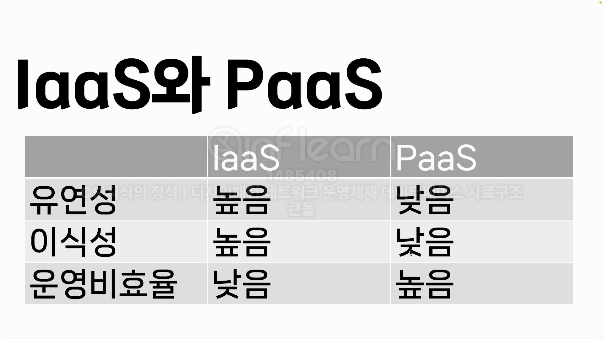

### laaS (Infrastructure-as-a-Service)

- 인프라형 클라우드 서비스임
  - ex. AWS의 EC2, NCP
- 클라우드가 단지 인프라를 제공함(빈 방을 제공함)
  - node.js, MongoDB 등을 개발자가 직접 설치해야 함
- 특정 서비스에 종속되지 않음

### Paas (Platform-as-a-Service)

- 플랫폼형 클라우드 서비스
  - ex. heroku
- 클라우드가 플랫폼을 제공함(풀옵션 방 생각하면 됨)
  - Node.js, MongoDB 등이 설치되어있음. 또는 클릭을 통해 해당 서비스를 설치 후 이용 가능
- 모니터링, CI/CD 제공

### Saas (Software as a Service)

- 대표적으로 Google Docs
- Google Docs는 클라우드를 통해 다른 컴퓨터에서도 쉽게 작업 가능, 다른 사람과의 실시간 공유작업이 가능함

### Paas와 Iaas 비교

> 면접에서 Paas와 Iaas를 많이 비교함

#### IaaS

- 유연하며 플랫폼에 종속되지 않습니다.
- 이식성이 높음
  - ex. 다른 서버로 옮길 때 수월함(빈방이었기 때문)
- 운영비 효율 낮음

#### PaaS

- 유연하지 않으며 플랫폼에 종속됩니다.
- 이식성은 낮음
  - ex. 다른 서버로 옮길 때 불편함(빌트인이었기 때문)
- 운영비 효율 좋음
  - ex. CI/CD, 모니터링, 로깅 무료로 되는 곳이 많고 편리해서 비용이 별로 안들음
    
