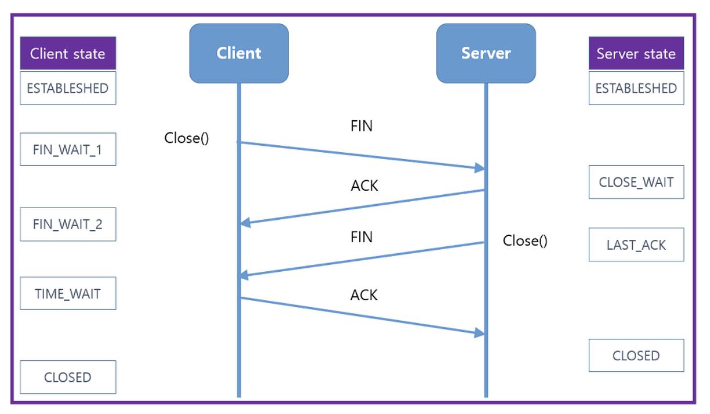

#### TCP의 연결해제

##### 4-way 핸드셰이크와 TIME_WAIT

###### TCP의 연결해제 과정은 다음과 같이 4개의 과정을 거침

1. 먼저 클라이언트가 연결을 닫으려고 할 때 FIN으로 설정된 세그먼트를 보냄. 그리고 클라이언트는 FIN_WAIT_1 상태로 들어가고 서버의 응답을 기다림
   <br>
2. 서버는 클라이언트로 ACK라는 승인 세그먼트를 보내고 CLOSE_WAIT 상태에 들어감. 클라이언트가 세그먼트를 받으면 FIN_WAIT_2 상태에 들어감
   <br>
3. 서버는 LAST_ACK 상태가 되며 일정 시간 이후에 클라이언트에 FIN이라는 세그먼트를 보냄
   <br>
4. 클라이언트는 TIME_WAIT 상태가 되고 다시 서버로 ACK를 보내서 서버는 CLOSED 상태가 되며 이후 클라이언트는 어느 정도의 시간(TIME_WAIT으로 설정된 시간)을 대기한 후 연결이 닫힘



##### TIME_WAIT

###### 지연 패킷 등이 발생했을 때 데이터 무결성을 해결하기 위해 패킷을 기다리는 시간

> MSL(Maximum Segment Lifetime)❓
> 최대 패킷 수명을 뜻함

- `2 * MSL`동안 기다림
- 연결이 올바르게 닫힌 상태로 만들기 위해 존재하기도 함
- 예를 들어 CLOSED가 아닌 LAST_ACK로 되어 있으면 그 다음 연결 때 오류가 나타나기 때문에 일정시간 기다리는 TIME_WAIT가 필요함
- CentOS6, 우분투에는 60초로 설정되어 있으며 윈도우는 4분으로 설정되어 있음. 즉, OS마다 조금씩 다를수 있음
  - Ex. 우분투 설정파일
    ```
    include/net/tcp.h
    #define TCP_TIMEWAIT_LEN (60*HZ) /* TIME-WAIT
    ```

##### 연결성립 + 연결해제과정 정리


