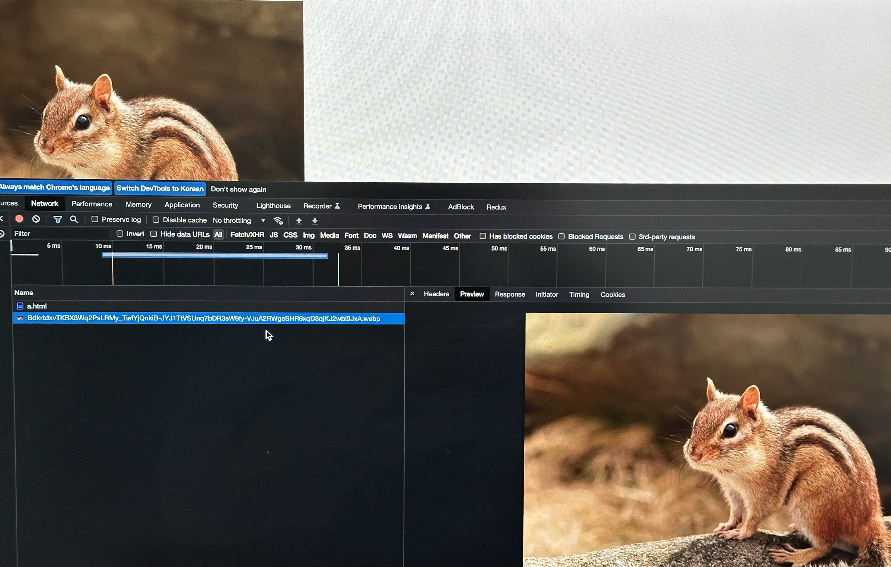
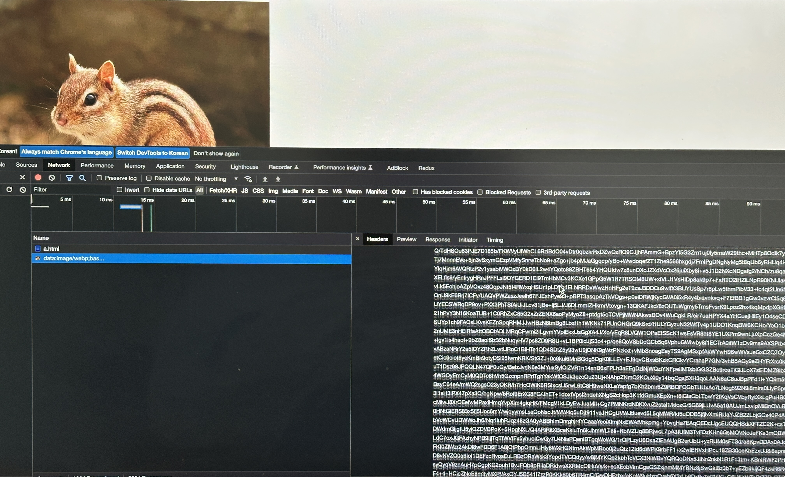
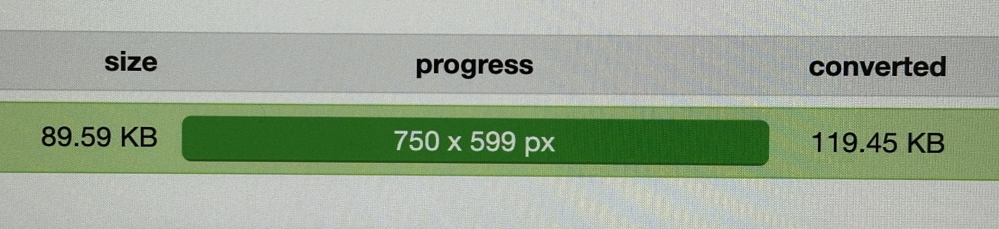

#### HTTP/1.0

- HTTP/1.0은 수명이 짧은 연결이라고 함
- HTTP 요청당 TCP 핸드셰이크가 발생되며 기본적으로 한 연결당 하나의 요청을 처리하도록 설계돼있음
- 한번 연결할 때마다 TCP연결을 계속해야 하니 RTT가 늘어나는 문제점이 있음
- 이를 해결하기 위해 HTTP/1.1이 등장함

> RTT(Round Trip Time)❓
> 신호를 전송하고 해당 신호의 수신확인에 걸린 시간을 더한 값이자
> 어떤 메시지가 두 장치 사이를 왕복하는 데 걸린 시간

#### HTTP/1.1

- HTTP/1.0의 단점을 보완한 프로토콜이며, 크게 3가지의 차이점이 있음

##### 1. keep-alive default


- 매번 데이터를 요청할 때마다 TCP 연결을 하는게 아닌 한번 해놓고 계속해서 데이터를 받을 수 있게 만듦. 이는 keep-alive 옵션을 기본옵션으로 하면서 가능해짐

##### Node.js 예시


- keep-alive header
  - TCP연결을 유지하는 것을 알려주는 헤더로 연결 유지 시간인 timeout과 최대 요청수 max를 정할 수 있음
  - node.js에서는 연결 유지 시간인 timeout 시간만을 지정할 수 있음

##### 2. 호스트 헤더

- HTTP/1.0은 서버가 하나의 호스트만 가진다고 가정하기 때문에 헤더에 호스트를 포함하지 않음
- 즉, HTTP/1.0은 하나의 IP에 하나의 호스트만 가질 수 있음
- 그러나 사실 서버는 여러개의 호스트를 가질 수 있으며 이런 유연성을 위해 HTTP/1.1은 헤더에 특정 호스트를 포함할 수 있게 변경되었으며 항상 호스트를 포함해서 요청하도록 변경됨

##### 3. 대역폭 최적화

- HTTP/1.0의 경우 어떠한 파일을 다운로드 받다가 연결이 끊기면 다시 다운로드 받는 것은 불가능함
- HTTP/1.1은 이를 다시 다운로드 받을 수 있게 변경됨
  - `Range:bytes=5000-` 라는 헤더를 추가해서 다운로드 재개 요청을 할 수 있음

---

#### 요청을 줄이기 위한 기술

- HTTP/1.1로 발전했음에도 불구하고 서버 요청할 때마다 RTT는 계속해서 증가하기 때문에 요청을 줄이기 위한 여러가지 기술들이 있음
- 대표적으로 이미지 스프라이트(image sprite), 코드 압축, Base64 인코딩 기술을 같이 사용함

##### 이미지 스프라이트


- 수많은 이미지를 하나의 이미지로 만들어 하나의 이미지만 다운받아놓고 이를 통해 수많은 이미지를 다운받는 듯한 효과를 내는 것

##### 코드 압축

```javascript
// 압축 전
const onError = () => {
  alert("에러가 발생했습니다.");
};
```

```
// 압축 후
const onError=()=>{alert("에러가 발생했습니다.")};
```

- 띄어쓰기 등을 제거하고 코드를 압축해서 서빙함
  <br>

##### 이미지 Base64 인코딩

###### 이미지 파일을 64진법으로 이루어진 문자열로 인코딩해서 이미지 서버에 대한 HTTP 요청을 할 필요가 없이 만드는 것

###### 인코딩 전



- HTML 파일과 별개로 이미지 파일에 대한 요청이 따로 들어감

###### 인코딩 후



- 이미지 요청이 따로 없고 HTML 파일에 포함돼있는 Base64 인코딩된 문자열을 기반으로 이미지가 렌더링 됨



- 하지만 Base64 인코딩을 할 경우 파일크기가 37퍼센트 크기가 더 커지는 단점이 있음

---

#### HTTP/1.1의 고질적인 문제 : HOL

> HOL(Head Of Line Blocking)❓
> 네트워크에서 같은 큐에 있는 패킷이 그 첫번째 패킷에 의해 지연될 때 발생하는
> 성능 저하 현상


- HTTP/1.1은 HOL과 무거운 헤더를 가지는 문제점이 있음
- HTTP/1.1은 위 그림과 같이 먼저 요청한 파일을 우선적으로 다운로드 해야 하기 때문에 나중에 요청한 파일을 다운로드하는데 걸리는 시간이 정말 짧더라도 먼저 요청한 파일 때문에 시간이 너무나도 길어지는 현상이 있었음
- 위 그림과 같이 HTTP/2 부터는 요청한 순서와 상관없이 비동기적으로 먼저 다운 받을 수 있게 변경됨
