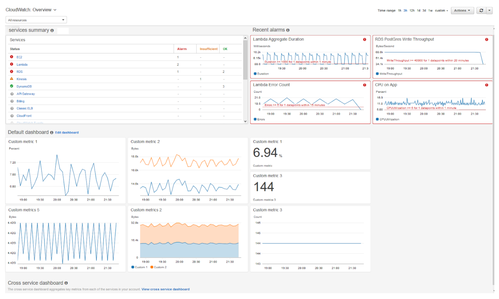

### 서버 과부하

###### 서버가 리소스를 소진하여 들어오는 요청을 처리하지 못할 때 발생. 이 때 서버는 사용자의 웹요청을 처리하지 못해 응답없음이 뜨게 됨

#### Ex. LCK 결승전

- 리그 오브 레전드 게임 대회 결승전 중계에 517만명의 동시 접속자수가 발생
- 중계하는 서비스 중 하나인 네이버 스포츠 서버가 과부화에 걸림
  
- 트래픽이 많이 발생하고 이를 적절히 해결하지 못하여 위와 같은 현상이 발생함

---

### 해결 방법

#### 모니터링을 통한 자원 할당

- 서버 과부화로 서버가 응답없음이 뜨는 이유는 여러가지가 있지만 그 중 하나가 **자원의 한계점 도달**임
- 보통 서버의 CPU 사용량이 80-90%에 도달하거나 메모리가 부족해 계속해서 스와핑이 발생하면 과부화 상태가 됨
- 이는 모니터링을 통한 자원의 적절한 할당으로 해결함
  - 자원은 CPU, 메모리, 대역폭도 포함

##### AWS 오토스케일링

- 서비스 이용 불가능 상태 발생 이전에 **cloud watch**가 계속해서 모니터링하여 서버 대수를 늘려주는 방법
- 애플리케이션을 자동으로 모니터링하고 자원의 용량을 자동으로 조정함

##### netdata를 이용한 모니터링

- AWS를 사용하지 않는다고 했을 때 무료 모니터링 서비스인 **netdata**를 사용할 수 있음
- 자원에 **threshold**라는 임계치를 설정해놓고 임계치를 넘어가면 슬랙 등의 서비스로 알림이 오게 하여 알림을 받으면 자원 할당을 하는 방식으로 사용함

---

### 모니터링을 왜 할까?

- 서버과부화로 인해 서버 중지에 대한 대처를 할 수 있음
  - 어떤 페이지에 어떤 트래픽이 얼마나 발생했는지
  - 어떤 네트워크에서 병목현상이 일어는지 등을 모니터링에서 알려줌
- 또한 활용도가 낮은 페이지, 높은 페이지를 파악할 수 있어 서비스 개선에도 도움이 됨
- 즉, 해결하기 위한 문제점을 파악하기 위해 모니터링은 필수적임
- **cloudflare**와 같은 서비스는 모니터링한 결과물을 알려주면서 서비스의 중단 등의 여부를 사용자에게 알려줌

---

### 로드밸런서

- AWS 오토스케일링은 빠르긴 하나 구성에 시간이 걸리기 때문에 앞단에 로드밸런서를 통해 트래픽을 분산해야 함
- 로드밸런서는 한 서버에 장애가 발생하면 로드 밸런서는 트래픽을 다른 기능 서버로 리디렉션하여 시스템 중단을 방지할 수도 있음

---

### 블랙스완 프로토콜

###### 예측할 수 없는 사고가 일어난 것

- 사후에는 이 사고의 원인 등을 분석할 수 있지만 사전에는 이 사고를 예측할 수 없는 것을 말함
  - **Ex.** 오스트레일리아에서 흑조가 발견될 때 사람들은 백조만 알았지 흑조가 있는 줄을 몰랐습니다. 일단 발견되고 나니 생물학계는 물론이고 전 유럽이 충격에 휩싸였죠. 그러나 과학적 연구를 통해 왜 흑조가 존재하는지 명확하게 알게 되었습니다.
- 블랙스완은 매번 일어나기 때문에 이에 따라 대비를 해야 함

#### Ex. 구글의 블랙스완 대처 방법

1. 영향을 받은 시스템과 각 시스템의 상대적 위험 수준을 확인

- 체계적으로 데이터를 수집하고 원인에 대한 가설을 수립한 후 이를 테스팅

2. 잠재적으로 영향을 받을 수 있는 내부의 모든 팀에 연락
3. 최대한 빨리 취약점에 영향을 받는 모든 시스템을 업데이트
4. 복원계획을 포함한 우리의 대응 과정을 파트너와 고객 등 외부에 전달
