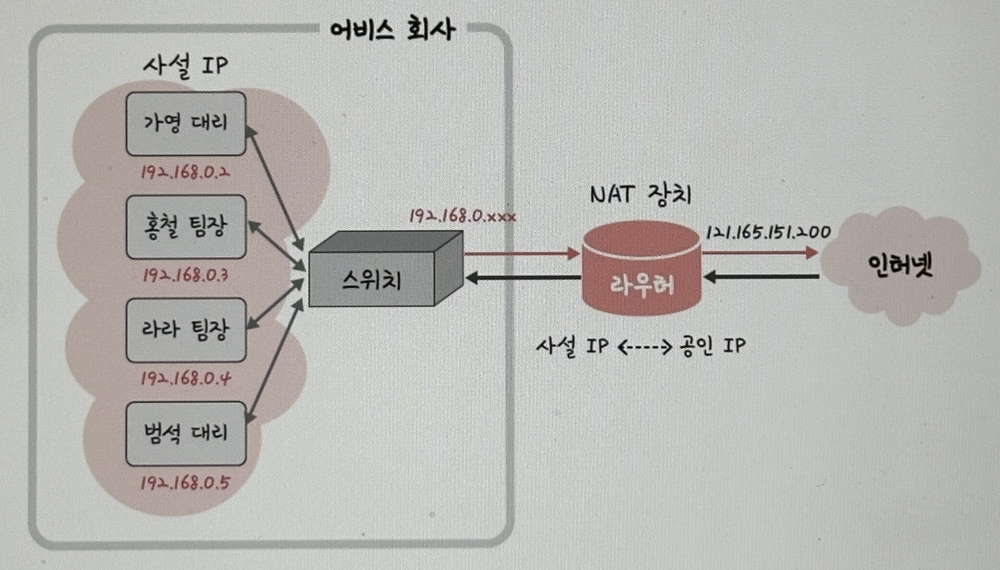

#### 공인IP(Public IP), 사설IP(Private IP)

- IPv4에서는 41억개의 주소를 가지기때문에 IP주소의 부족을 공인IP(public IP)와 사설IP(private IP)로 나누고 중간에 NAT이라는 기술을 통해 해결함

##### 공인IP

###### 전 세계 어느 곳에서든 유일하게 할당되어, 인터넷상에서 직접 라우팅 가능한 IP 주소

- ISP(Internet Service Provider)나 등록 기관(IANA, RIR 등)에서 발급된 IP가 보통 **공인 IP**라고 불림
- 각 기기가 공인 IP를 갖고 있으면, 인터넷에서 직접 통신할 수 있음(서버나 PC가 외부에서 접근 가능)
- **Ex.**
  - 8.8.8.8(구글 DNS)
  - 1.1.1.1(클라우드플레어 DNS)
  - 특정 집/회사/서버가 ISP에게서 받은 고정/동적 IP 등

##### 사설IP

###### 로컬 네트워크 내에서만 사용하고, 인터넷상에서 직접 라우팅되지 않는 IP 주소

- 전 세계적으로 중복 가능하지만, 공인 네트워크로 바로 접근할 수 없고, NAT 등 중계 장치를 통해서만 외부와 통신함
- 같은 사설 IP 대역이라도, 각각 다른 내부망에서라면 중복 사용이 가능
- **Ex.**
  - 수많은 가정집의 192.168.0.x

#### NAT(Network Address Translation)

###### 패킷이 트래픽 라우팅 장치를 통해 전송되는 동안 패킷의 IP주소를 변경, IP 주소를 다른 IP 주소로 매핑하는 방법

- NAT을 통해 내부 네트워크 IP가 노출되지 않는다는 점이 장점임

---

#### 공유기와 NAT

- 실생활에서 인터넷 회선 하나를 개통하고 보통 공유기를 써서 Wifi를 만듦
- 이 때 여러 대의 호스트가 하나의 공인 IP 주소를 사용하여 인터넷에 접속하게 되기때문에 Wifi에는 NAT가 적용돼있음
