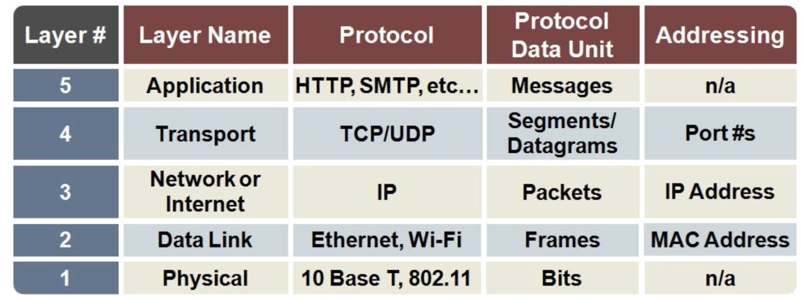

# 네트워크를 이루는 장치의 이해

네트워크 기기는 계층별로 나눌 수 있음.

상위 계층을 처리하는 기기는 하위계층을 처리할 수 있음.
but, 그 반대는 불가

Ex) 애플리케이션 계층의 로드밸런서는 네트워크 분산처리 가능.
그러나 물리 계층의 NIC는 하지 못 함.

## 레이어별 프로토콜, PDU 정리

## 레이어별 네트워크 장치

- 애플리케이션 계층: L7 스위치
- 전송 계층: L4 스위치
- 인터넷 계층(네트워크 계층): 라우터, L3 스위치
- 데이터 링크 계층: L2 스위치, 브리지
- 물리 계층: NIC, 리피터, AP
