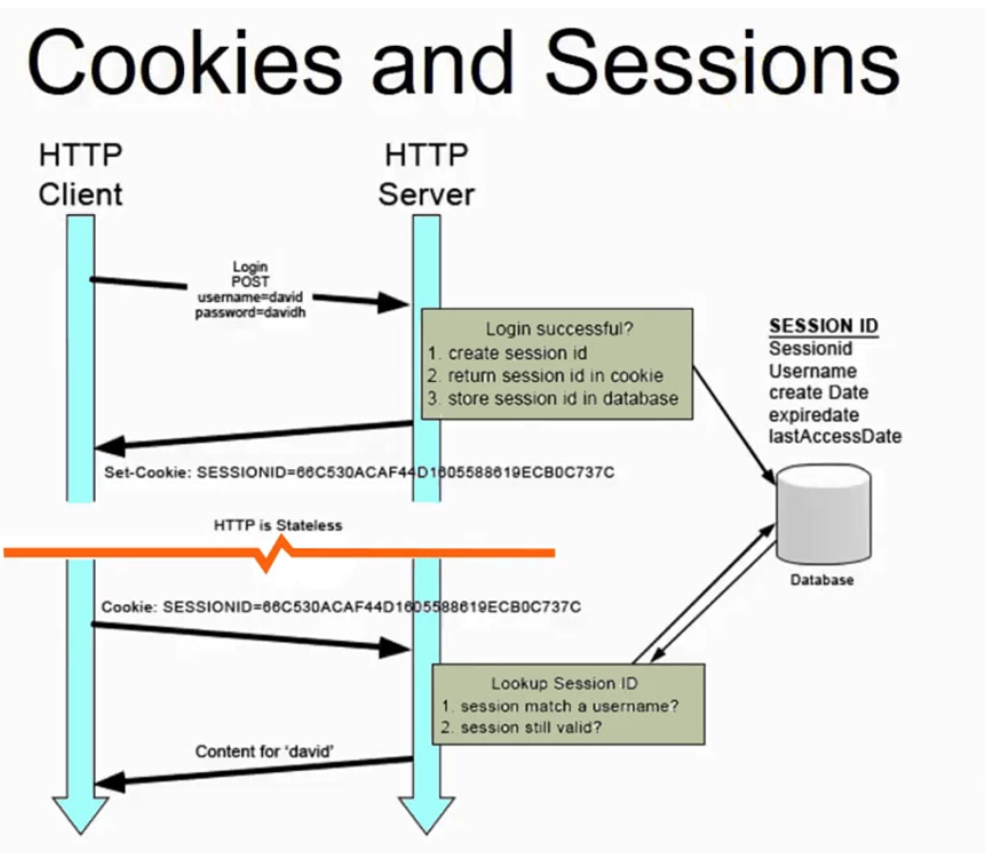

# 로그인 #1. 세션기반인증방식 : 개념

HTTP 요청을 통해 데이터를 주고 받을 때 요청이 끝나면 요청한 사용자의 정보 등을 유지하지 않는 특징이 있다.

=> 로그인 상태를 유지해야 한다!

> **세션**이란?
>
> 서버와 클라이언트의 연결이 활성화된 상태

> **세션ID**란?
>
> 웹 서버 또는 DB에 저장되는 클라이언트에 대한 유니크한 ID

## 세션기반 로그인 프로세스

1. 로그인 -> 세션ID 생성 -> 서버에 세션ID를 쿠키로 설정하여 클라이언트에 전달
2. 클라이언트가 서버에 요청을 보낼 때 해당 세션ID를 쿠키로 담아서 전에 로그인했던 아이디인지 확인
3. 로그인을 유지

## 단점

1. 사용자의 상태에 관한 데이터를 서버에 저장했을 때 로그인 중인 유저의 수가 늘어난다면 **서버의 메모리 과부화** 발생
2. RDBMS에 저장한다면 **직렬화 및 역직렬화에 관한 오버헤드**가 발생 (형태 변화하는데 오베헤드 발생)
