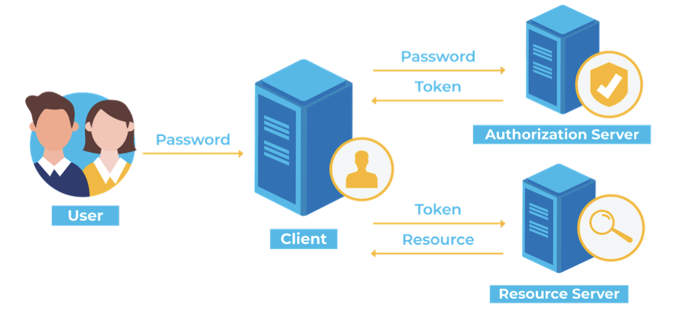
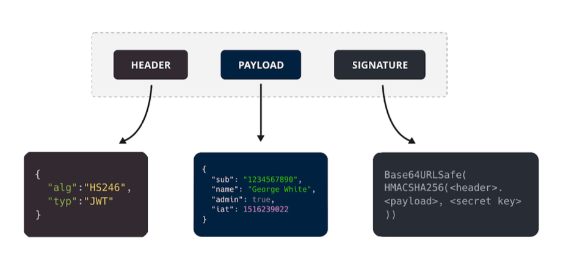

# 로그인 #3. 토큰기반인증방식(access토큰, refresh토큰) 개념

## 토큰 기반 인증 방식

state(상태)를 모두 토큰 자체만으로 처리하며 토큰을 처리하는 한 서버를 두고 다른 컨텐츠를 제공하는 서버는 모두 stateless(무상태)하게 만들자는 이론이 담긴 방식.

> 토큰을 관리하는 서버를 따로 두는 이유는?
>
> 토큰기반인증 + A도메인을 처리하는 서버를 구축할 경우, A도메인에서 에러가 발생하면
> 인증에 관한 기능이 마비되고 이는 B, C, D 등의 도메인 기능이 연쇄적으로 마비될 수 있기 때문에.

토큰은 주로 JWT 토큰을 활용한다.

1. 인증로직 -> JWT 토큰 생성(access 토큰, refresh 토큰)
2. 사용자가 이후에 access token을 HTTP Header - Authorization 또는 HTTP Header - Cookie에 담아 인증이 필요한 서버에 요청해 원하는 컨텐츠를 가져옴

## JWT란?

JSON Web Token을 의미하며 헤더, 페이로드, 서명으로 이루어져 있으며 JSON 객체로 인코딩되며 메시지 인증, 암호화에 사용됨.

`Header`: 토큰 유형과 서명 알고리즘, base64URI로 인코딩 됨.

`Payload`: **데이터**, 토큰 발급자, 토큰 유효기간, base64URI로 인코딩 됨.

`Signature`: (인코딩된 header + payload) + 비밀키를 기반으로 헤더에 명시된 알고리즘으로 다시 생성한 서명값.

## 장점

1. 사용자 인증에 필요한 모든 정보는 토큰 자체에 포함하기 때문에 별도의 인증 저장소가 필요 없음.
2. 다른 유형의 토큰과 비교했을 때 경량화되어있음.
3. 디코딩했을 때 JSON이 나오기 때문에 JSON을 기반으로 쉽게 직렬화, 역직렬화가 가능.

## 단점

1. 토큰이 비대해질 경우 서버 과부화에 영향을 줌.
2. 토큰을 탈취당할 경우 디코딩했을 때 데이터를 볼 수 있음.
