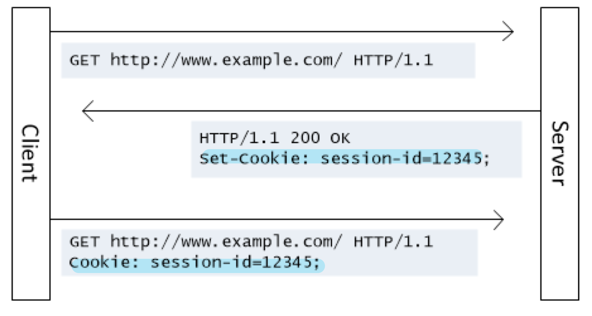

# 웹브라우저의 캐시 #5. 쿠키

- 브라우저에 저장된 데이터 조각
- 클라이언트, 서버에서 설정 가능 (보통 서버에서 먼저 설정하여 쿠키 생성)
- 서버에서 응답헤더로 `Set-Cookie`로 설정해서 쿠키를 보내면, 클라이언트에서 요청헤더 Cookie에 설정되어 자동으로 서버에 전달되고 브라우저에도 저장
- 서버에서 만료기한 등을 설정
- 저장용량 4KB
- ex) 로그인, 장바구니, 사용자 커스터마이징, 사용자 행동분석



## 클라이언트에서도 설정가능한 쿠키

클라이언트에서 `document.cookie`를 통해 쿠키를 설정하거나, 보낼 때 `header-Cookie` 값을 정해서 보낼 수 도 있다.

```js
axios.get(url, {
  headers: {
    Cookie: "cookie1=value; cookie2=value; cookie3=value
  }
})
```

🚨 하지만 권장 하지 않는다!

=> 쿠키에는 보통 민감한 정보들이 담길 수 있기 때문에, 제어권은 **서버**에 둬야 한다.

## 세션 쿠키

`Expires` 또는 `Max-Age` 속성을 지정하지 않은 것으로, **브라우저가 종료되면 쿠키도 사라짐**.

## 영구 쿠키

`Expires` 또는 `Max-Age` 속성을 지정하여, **특정 날짜 또는 일정 기간이 지나면 삭제되게 만든 쿠키**.

## 문법

```js
Set-Cookie: <cookie-name>=<cookie-value>
Set-Cookie: <cookie-name>=<cookie-value>; Expires=<date>
Set-Cookie: <cookie-name>=<cookie-value>; Max-Age=<non-zero-digit>
Set-Cookie: <cookie-name>=<cookie-value>; Domain=<domain-value>
Set-Cookie: <cookie-name>=<cookie-value>; Path=<path-value>
Set-Cookie: <cookie-name>=<cookie-value>; Secure
Set-Cookie: <cookie-name>=<cookie-value>; HttpOnly
Set-Cookie: <cookie-name>=<cookie-value>; SameSite=Strict
```

### 1. Secure

https로만 쿠키를 주고받을 수 있게 하는 옵션이다.

Chrome v89 및 Firefox v75이상의 `localhost`에서는 해당 옵션을 무시하여 로컬 개발 환경에서 쉽게 테스트 가능하다.

### 2. HttpOnly

공격자가 쿠키를 자바스크립트로 빼낼 수 없게 만든다.
(`document.cookie`로 접근 불가)

=> **XSS** 공격 방지

### 3. SameSite

요청이 동일한 도메인에서 시작된 경우에만 쿠키가 애플리케이션으로 전송되도록 허용한다.

### 실습

```js
const http = require('http');
const hostname = '127.0.0.1';
const port = 3000;
const server = http.createServer((req, res) => {
  res.setHeader('Content-Type', 'text/plain; charset=utf-8');
  res.setHeader('Set-Cookie', [
    'kundol = amumu; httponly',
    'loltier = master; Secure',
  ]);
  res.end('큰돌, 그는 신인가?!\n');
});
server.listen(port, hostname, () => {
  console.log(`Server running at http://${hostname}:${port}/`);
});
```

### 쿠키의 시큐어코딩

쿠키 - 세션으로 로그인을 처리하게 된다면 시큐어 코딩을 해야 한다.

- http only 옵션
- secure 옵션
- 일정시간의 세션 타임아웃
