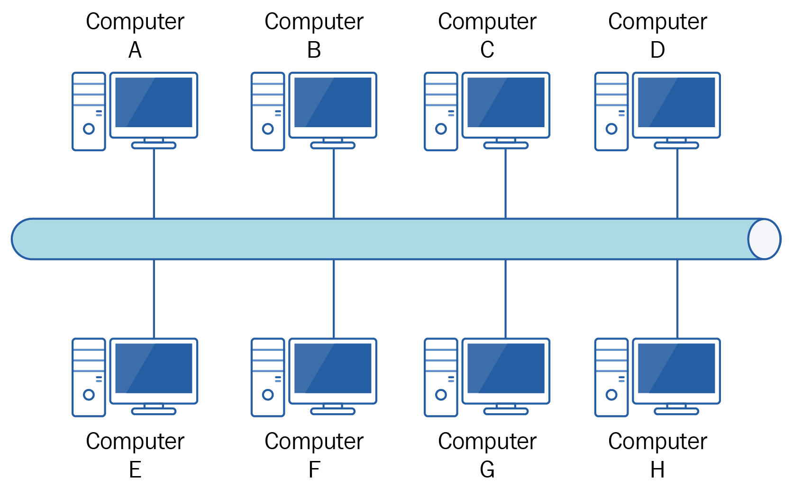
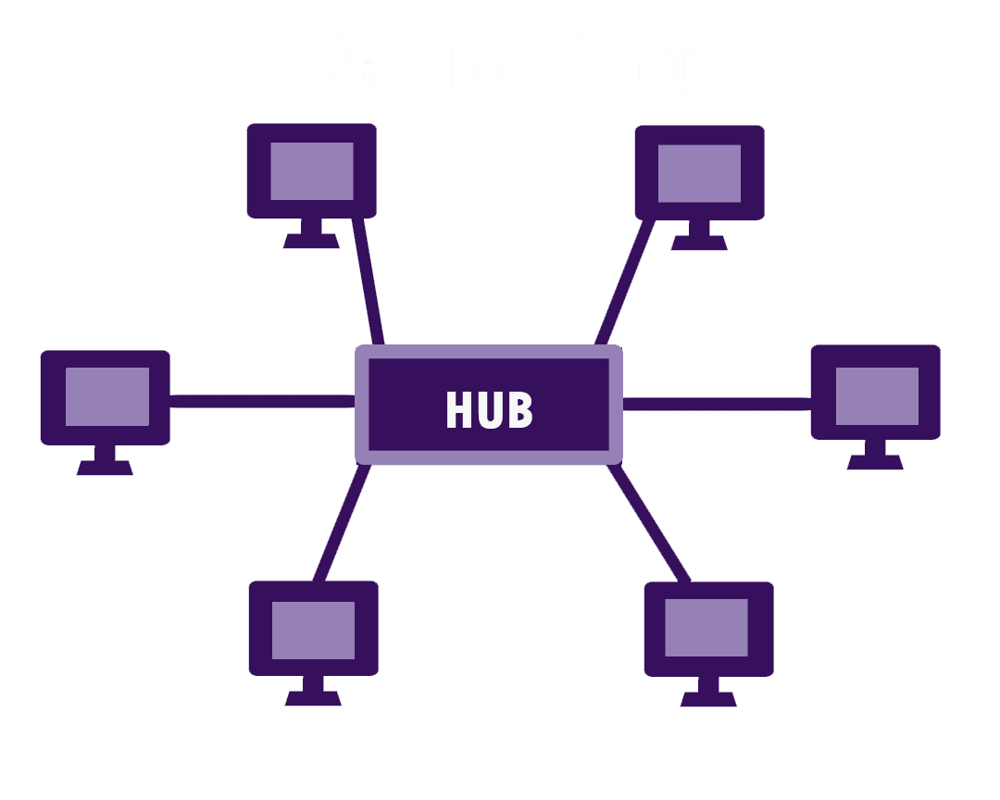
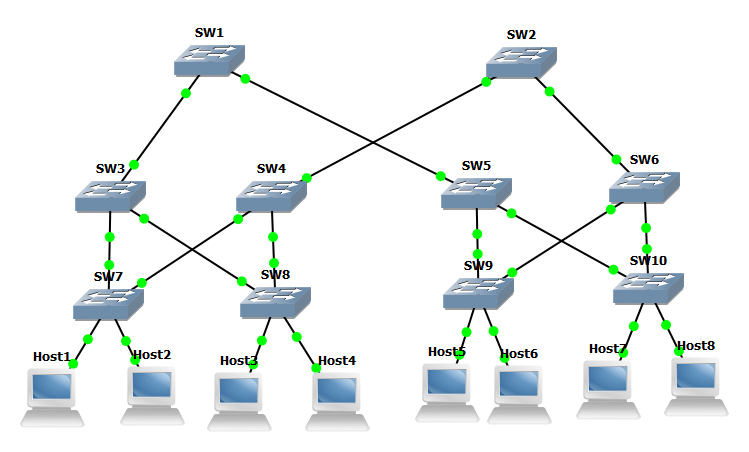
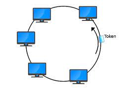
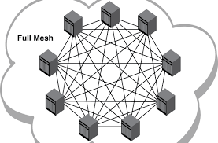
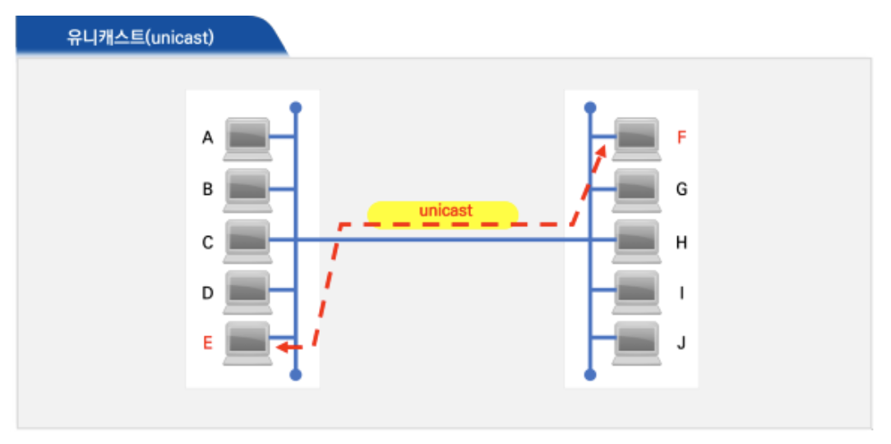
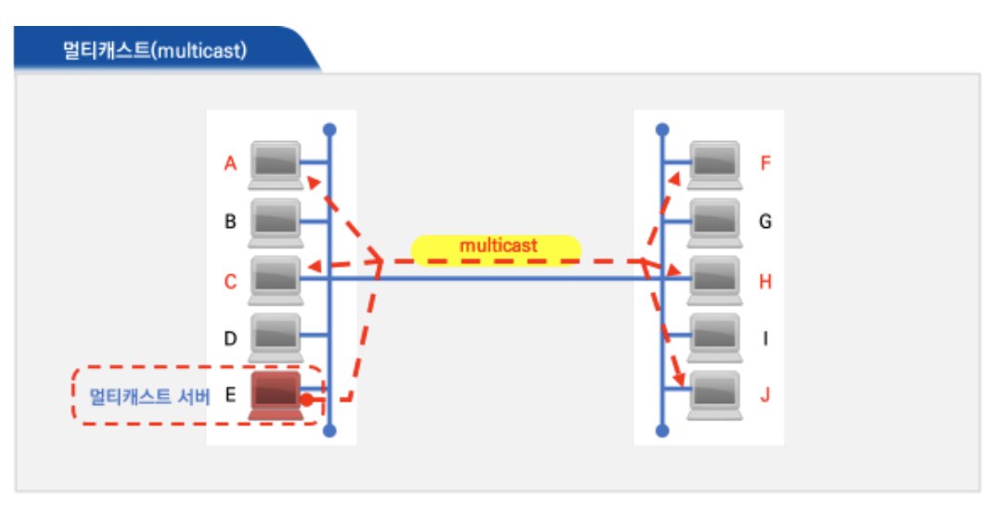
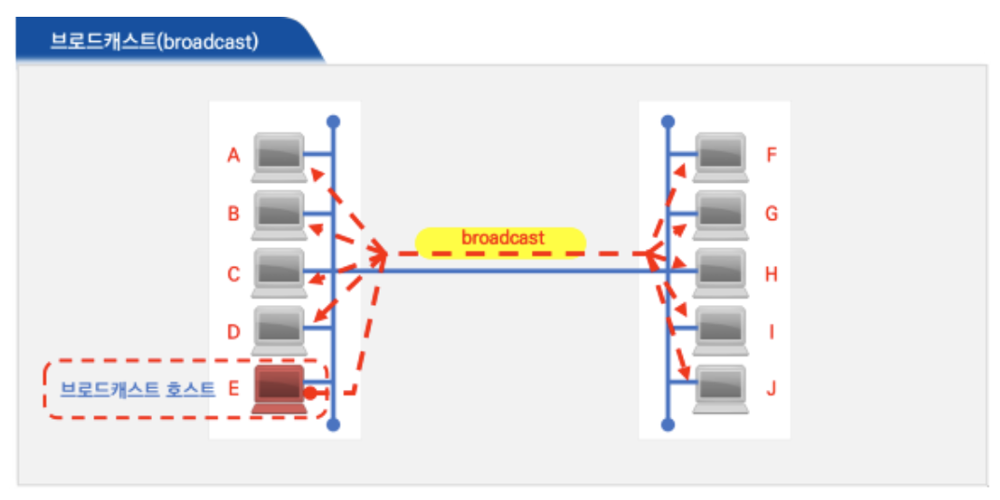

# 네트워크 토폴로지: 버스, 스타, 트리, 링, 메시

## 네트워크 토폴로지란?

컴퓨터 네트워크에 참여하는 요소(링크, 노드)들의 배치형태, 망구성방식을 의미한다.

- 물리적 토폴로지 : 노드와 전선, 케이블 등등 네트워크 사이의 물리적 연결 및 상호 연관을 나타낸다.
- 논리적 토폴로지 : 좀 더 추상적이고 전략적이며, 네트워크 배치의 방식과 이유, 데이터가 네트워크를 통해 어떻게 흐르는지를 개념적으로 이해할 수 있게 한다.

네트워크 토폴로지를 능률적이고 적절하게 관리하면 에너지 효율성과 데이터 효율성이 높아져 결과적으로 운영비와 관리비를 줄이는 데 도움이 된다. 네트워크의 배치 방식에 따라 네트워크의 기능성, 연결성이 살아나거나 망쳐지기도 하고, 시스템이 중단되는 다운 타임도 배치 방식에 의해 좌우된다.

### 버스 토폴로지

버스 토폴로지는 네트워크 상의 모든 장치가 하나의 케이블로 연결되어 있다.

#### 버스 토폴로지 특징

- 네트워크의 한쪽 끝에서 다른 쪽 끝으로 연결되어 있어 "선형 토폴로지" 또는 "백본 토폴로지" 라고도 부른다.
- 네트워크 상의 데이터 흐름 역시 케이블의 경로를 따라 한 방향으로 흘러간다.

#### 버스 토폴로지 장점

- 네트워크 배치가 단순해 모든 장치가 하나의 동축 케이블 또는 RJ45 케이블로 연결되기 때문에 비용 효율적이고 소규모 네트워크에 적합하다.
- 필요하다면 추가로 케이블을 연결해 네트워크에 노드를 쉽게 더할 수 있다.

#### 버스 토폴로지 단점

- 데이터를 전송하는 데 하나의 케이블만을 쓰기 때문에 취약한 부분이 있다.
- 케이블에 장애가 발생하는 경우 전체 네트워크가 멈추게 되며, 복구하는데 시간과 비용이 많이 든다.
- 높은 대역폭을 지니지만, 노드를 추가할 때마다 대역폭이 낭비되어 데이터 전송 속도를 늦추기 때문에 소규모 네트워크에 알맞다.
- 데이터가 "반 이중" 방식으로 전달되어 데이터를 동시에 양방향으로 보낼 수 없어 막대한 트래픽을 전송해야 하는 네트워크라면 알맞지 않다.

### 스타 토폴로지

가장 흔하게 쓰이는 네트워크 토폴로지로, 네트워크 안의 모든 노드가 동축 케이블이나 연선 또는 광케이블을 통해 직접 하나의 중앙 허브에 연결된다.

#### 스타 토폴로지 특징

- 중앙 노드는 서버로서 작동하여 데이터의 흐름을 관리한다.
- 네트워크 안의 각각의 노드에서 보낸 정보가 목적지에 닿기 위해서는 반드시 중앙 노드를 지나야 한다.
- 중앙 노드는 신호를 수신하여 재전송 시키는 리피터처럼 기능하여 데이터 손실을 막아준다.

#### 스타 토폴로지 장점

- 전체 네트워크를 한 장소에서 편리하게 관리할 수 있다.
- 각각의 노드는 중앙 허브와 독립적으로 연결되어 있어서 노드 하나에 장애가 발생하더라도 나머지 네트워크는 영향을 받지 않는다. (안정적이고 안전함)
- 전체 네트워크를 오프라인으로 하지 않고도 장치를 추가, 제거, 수정이 가능하다.
- 네트워크 전부 연결하는데 상대적으로 적은 케이블을 사용하기 때문에 네트워크를 확장, 축소시 설정과 관리가 간단하다.
- 네트워크 디자인이 단순해서 장애가 발생하거나 성능에 이상이 생긴 경우 쉽게 찾아낼 수 있다.

#### 스타 토폴로지 단점

- 중앙 허브에 장애가 생기면 네트워크가 모두 멈춘다.
- 네트워크의 전체적 대역폭과 성능이 중앙 노드의 설정과 기술적 사양에 의해 제한되는 것 또한 스타 토폴로지의 설정비와 운영비를 높이는 요인이 된다.

### 트리 토폴로지

트리 토폴로지 구조는 네트워크에서 나무줄기처럼 기능하는 중앙 노드와 가지처럼 바깥으로 뻗어 나가는 노드들의 모양에서 이름을 따왔다.

#### 트리 토폴로지 특징

- 트리 토폴로지에서 노드들은 부모-자식 계층 구조로 연결되어 있다.
- 중앙 허브에 연결된 노드는 다른 노드와 선으로 연결되어 있어, 연결된 두 개의 노드는 하나의 연결만을 상호 공유한다.
- 극히 유연하고 네트워크 확장이 매우 쉬워, 광역 통신망에 사용되어 넓게 퍼진 장치들을 지원한다.

#### 트리 토폴로지 장점

- 스타 토폴로지와 버스 토폴로지의 요소가 결합한 구조로 노드 추가와 네트워크 확장이 쉽다.
- 성능에 이상이 생긴 경우 각각의 가지에 개별적으로 접근할 수 있기 때문에 네트워크 장애를 해결하는 과정 역시 복잡하지 않다.

#### 트리 토폴로지 단점

- 전체 네트워크의 안정성이 트리 토폴로지 구조의 뿌리인 중앙 노드에 달려있다. 중앙 허브에 문제가 발생하면, 가지 시스템 내에서는 연결되어 있더라도 가지들 사이의 연결은 끊어진다.
- 계층 구조의 복잡성과 네트워크 배치의 선형 구조 때문에 노드를 추가할 수록 적절한 관리를 하기 어려워진다.
- 계층적 배치안에서 각각의 장치들을 다음 장치와 연결하는데 드는 케이블의 양만으로도 트리 토폴로지의 설치 비용이 많이 든다.

### 링 토폴로지

단방향 대 양방향. 링 토폴로지에서 노드들은 원 또는 고리 모양으로 배열되어 있다.

#### 링 토폴로지 특징

- 데이터가 원 모양의 네트워크를 따라 한 방향 또는 양방향으로 흐르며 각각의 장치 양옆에는 두 개의 이웃 노드가 꼭 존재한다.
- 각각의 장치는 양쪽 이웃한 장치에만 연결되어 있어, 데이터가 전송될 때 데이터 블록인 패킷 역시 원을 따라 흐르면서 목적지에 도달할 때까지 중간에 있는 노드들 각각을 지나가게 된다.

#### 링 토폴로지 장점

- 대규모 네트워크를 링 토폴로지로 배치한다면, 패킷이 목적지에 데이터 손실 없이 정확히 도달할 수 있도록 데이터 증폭 장치인 리피터를 사용할 수 있다.
- 링 토폴로지에서는 한 번에 하나의 노드에서만 데이터를 전송할 수 있기 때문에 패킷이 충돌할 위험이 거의 없어 데이터를 오류 없이 효율적으로 전송할 수 있다.
- 비용 효율적이며, 설치 비용이 저렴하다
- 노드들이 점 대 점으로 얽혀 있어 네트워크에 잘못된 설정이 있거나 장애가 발생한 경우 상대적으로 문제를 쉽게 찾을 수 있다.

#### 링 토폴로지 단점

- 가장 많이 사용되는 방식 중 하나이지만, 네트워크를 적절히 관리하지 않으면 여전히 장애가 발생할 위험이 있다.
- 데이터가 개별링을 따라 한 방향으로 흐르기 때문에, 노드 하나에 문제가 발생하면 전체 네트워크가 중단될 수 있다.
- 네트워크 안의 모든 장치가 대역폭을 공유하므로, 장치를 추가하면 전반적으로 통신 지연을 일으킬 수 있다. 장치를 추가할 때 네트워크의 자원과 용량에 과중한 부담을 주지 않도록 주의해야 한다.
- 노드를 재설정하거나 추가, 제거를 하기 위해서는 전체 네트워크를 중단해야 된다.

### 메시 토폴로지

노드들을 점 대 점으로 상호 연결한 구조로 복잡하고 정교하다.

#### 메시 토폴로지 특징

- 메시 네트워크는 완전 메시형과 부분 메시형이 있다.
  - 부분 연결형 메시 토폴로지: 대부분이 상호연결된 가운데, 몇몇 노드들은 두세 개 장치들과만 연결되어 있다.
  - 완전 연결형 메시 토폴로지: 모든 노드가 상호연결되어 있다.
- 데이터를 라우팅과 플러딩의 두 가지 다른 방법으로 전송된다.
  - 라우팅 방식: 노드는 출발지부터 목적지까지의 최단 거리를 논리적으로 결정하여 데이터를 전송한다.
  - 플러딩 방식: 정보는 네트워크 안의 모든 노드로 보내져 논리적으로 최단 거리를 결정할 필요가 없다.

#### 메시 토폴로지 장점

- 안정성과 보안성이 뛰어나다.
- 노드 간에 상호 연결된 정도가 높고 복합적이어서 장애에 강하다. 단일 장치가 고장나도 네트워크가 오프라인이 되는 경우가 없다.

#### 메시 토폴로지 단점

- 노동 집약적이다. 네트워크를 배치할 때 노드 사이 각각을 연결할 때마다 케이블이 필요하고 설정을 해줘야 하므로 설치하는 시간도 오래 걸린다.
- 케이블에 드는 비용이 정말 많이 든다.

# 네트워크 토폴로지의 필요성과 병목현상

## 필요성

토폴로지를 파악함으로서 병목현상을 해결하는 척도가 된다.

## 병목현상

- 병목 현상은 네트워크에서 트래픽에 의해 데이터 흐름이 제한되는 상황을 말하고, 핫스팟이라고도 한다.
- 구축된 시스템의 토폴로지를 알고 있다면 어떤 부분이나 회선, 서버에서 용량을 증가시켜야 하는지 알 수 있다.

# 유니캐스트, 멀티캐스트, 브로드캐스트

## 유니캐스트

1:1 통신이며 대표적으로 HTTP 통신이 있다. 가장 일반적인 네트워크 전송 형태이다.

### 유니캐스트 특징

- 중간에 데이터가 손실되거나 왜곡되는 일이 거의 없다.
- 특정 수신자에게만 전송되어 보안성이 좋다.

## 멀티캐스트

1:N 통신이며 연결된 모든 노드들에게 데이터를 전달하지는 않고, 특정 그룹에게만 데이터를 전달한다.

### 멀티캐스트 특징

- 그룹 내의 모든 수신자에게 한 번에 데이터를 전송하므로, 데이터의 중복 전송으로 인한 네트워크 자원 낭비를 최소화할 수 있다.
- UDP 기반으로 동작하여 데이터가 손실되었을 때 복구 메커니즘이 없다.
- IPTV와 같은 실시간 방송이나 사내방송 같은 단방향 서비스도 다수에게 동시에 같은 내용을 전송하며 멀티캐스트 방식 사용한다.

## 브로드캐스트

1:N 통신이며 그룹이 아닌 연결되어있는 모든 노드에게 데이터를 전달한다.

### 브로드캐스트 특징

- 네트워크 트래픽을 증가시킬 수 있으며, 대규모 네트워크에서는 트래픽 혼잡을 초래할 수 있다.
