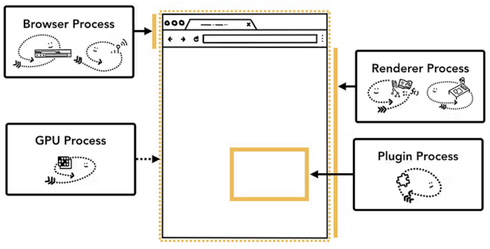

# 멀티프로세싱과 멀티스레딩

여러개의 스레드 또는 프로세스를 만든 상태를 멀티스레드, 멀티프로세스라고 하며 이를 기반으로 작업을 하는 것을 멀티스레딩, 멀티프로세싱이라고 한다.

## 멀티프로세싱

###### 여러 개의 ‘프로세스’, 즉 멀티프로세스를 통해 동시에 두 가지 이상의 일을 수행할 수 있는 것을 말한다.

- 특정 프로세스 중 일부에 문제가 발생되더라도 다른 프로세스에 영향을 미치지 않으며 격리성과 신뢰성이 높다.
- CPU를 여러 개 쓰는 병렬 처리에 적합하다.
- 전환 비용이 상대적으로 비싸다.
- Ex. 대규모 데이터 연산, 이미지 처리

## 멀티스레딩

###### 프로세스 내 작업을 멀티스레드로 처리하는 기법

- 스레드끼리 서로 자원을 공유하고 프로세스보다는 가볍기 때문에 효율성이 높다.
- 전환 비용이 상대적으로 저렴하다.
- Python에서는 GIL(Global Interpreter Lock) 때문에 멀티스레딩이 동시에 CPU를 여러 개 활용하지 못해 병렬 처리가 어렵다.
- 하지만 한 스레드에 문제가 생기면 다른 스레드에도 영향을 끼쳐 스레드로 이루어져 있는 프로세스에 영향을 줄 수 있는 단점이 있다.
- Ex. 웹 크롤링, 파일 읽기/쓰기, API 요청 등

  

브라우저는 멀티프로세스이자 멀티스레드 아키텍처를 가진 소프트웨어이다.

### 멀티프로세스 구조

### 멀티스레드 구조

