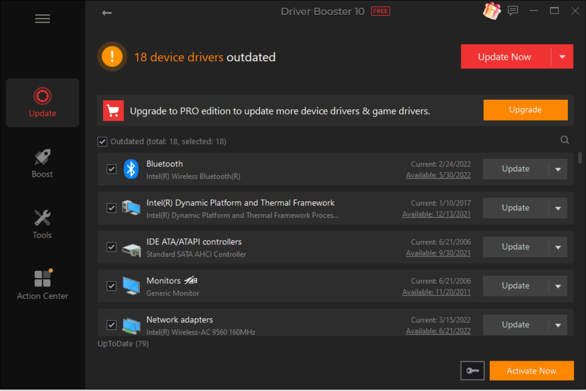

### 운영체제의 종류

운영체제는 앞단의 어떤 인터페이스를 두느냐에 따라 GUI와 CUI로 나눌 수 있다.

#### GUI(Graphical User Interface)

###### 그래픽을 사용하여 컴퓨터와 상호작용하는 인터페이스

windowOS, macOS 등 현대의 OS가 이를 대표한다.

- GUI를 사용하는 macOS의 바탕화면
- 하단 프로그램 들에 마우스를 가져다 대면 해당 프로그램 이름이 표시되는 등 그래픽을 통해 사용자와 상호작용하는 운영체제다

#### CUI(Character User Interface)

###### 사용자가 키보드만을 사용하여 문자를 기반으로 컴퓨터와 상호작용하는 인터페이스

1994년 단종된 OS인 MS-DOS가 대표적이다.

chatGPT 또한 문자를 기반으로 상호작용하는 CUI라고 할 수 있다.

---

### 운영체제의 역할

운영체제의 역할은 다음과 같다. 이는 운영체제의 커널이 담당한다.

- CPU 스케줄링과 프로세스 상태 관리
  - 어떤 프로세스를 먼저 실행시킬건지에 대한 우선순위 관리 등
- 메모리 관리
  - 32GB 메모리를 사용중일때, 메모리 사용량이 32GB가 넘어가면 어떻게 처리할건지 등(스와핑, 페이지 폴트 등)
- 디스크 파일 관리
  - 프로그램을 저장할 때 하드디스크에 저장하는데, 어떻게 저장할건지 등
- I/O 디바이스 관리
  - 키보드, 마우스 등 장치에 대한 관리

---

### 운영체제의 구조

아래 중 인터페이스, 시스템 콜, 커널이 운영체제에 해당한다.

- 유저 프로그램
- **인터페이스(GUI 또는 CUI)**
- **시스템 콜(System Call)**
- **커널(I/O 드라이버, 파일시스템 등)**
- 하드웨어(Hardware)
  
- 마우스, 키보드 등을 사용할때 드라이버를 다운로드 받아서 사용한다. 드라이버를 기반으로 OS를 거쳐 하드웨어와 통신한다.

---

### 컴퓨터 시스템의 구조

컴퓨터 시스템의 구조는 다음과 같다.

- CPU : 인터럽트에 의해 메모리에 존재하는 명령어를 해석해서 실행하는 일꾼
- DMA 컨트롤러 : CPU의 일을 보조하는 일꾼
- 메모리 : 전자회로에서 데이터, 상태 등을 기록하는 장치(작업장)
- 타이머 : 특정 프로그램에 시간을 다는 역할
  - 무한 루프에 빠지는 프로그램을 제한해준다.
- 디바이스 컨트롤러 : I/O 디바이스들의 작은 CPU
- 로컬 버퍼 : 키보드, 헤드셋, 디스크 등 디바이스에 달려 있는 작은 메모리

---

### CPU

###### 산술논리연산장치, 제어장치, 레지스터로 구성되어있는 장치. 인터럽트에 의해 메모리에 존재하는 명령어를 해석해서 실행하는 일꾼이다.

#### 산술논리 연산장치(Arithmetic and Logical Unit, ALU)

###### 덧셈, 뺄셈, 곱셈, 나눗셈 등 산술연산과 논리연산을 하는 회로 장치

#### 제어장치(Control Unit, CU)

###### 프로세스의 조작을 지시하며 명령어들을 읽고 해석하며 데이터 처리를 위한 순서를 결정하는 장치

#### 레지스터

###### CPU안에 있는 매우 빠른 임시 기억장치
