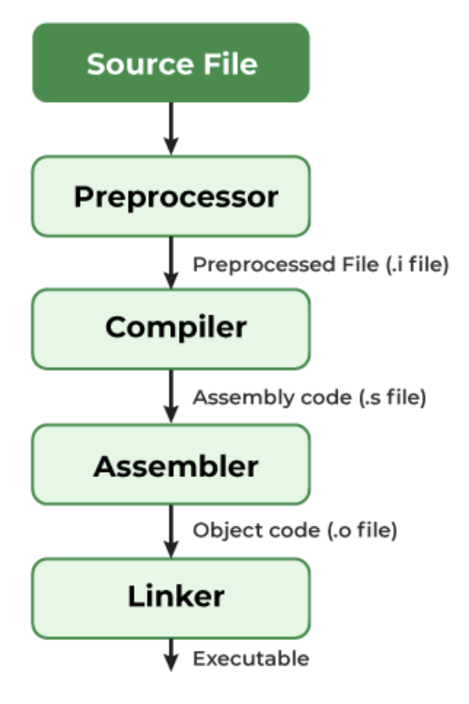
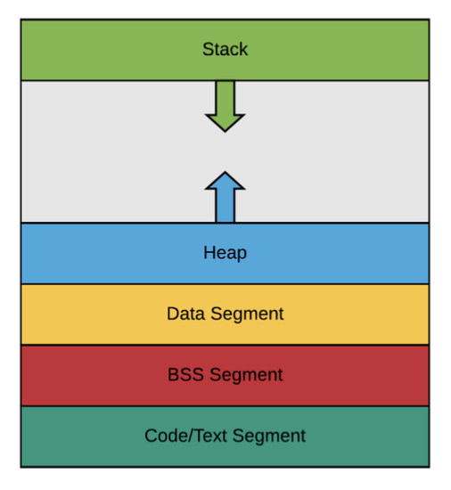

# 프로세스와 스레드의 차이

## 프로세스

컴퓨터의 메모리에 올라와 실행되고 있는 프로그램, task와 같은 의미로 쓰인다.

## 스레드

프로세스 내 작업의 흐름을 지칭.

### 프로세스와 스레드의 차이

1. 프로세스는 코드, 데이터, 스택, 힙 메모리 영역을 기반으로 작업하는 반면 스레드는 프로세스 내의 스택 메모리를 제외한 다른 메모리 영역을 프로세스 내의 다른 스레드들과 공유하기 때문에 메모리적 이점이 있다.

2. 프로세스는 다른 프로세스와 격리되어있기 때문에 서로 통신을 하기 위해서 IPC를 사용해야 하지만 스레드는 다른 스레드와 서로 격리되어있지 않으므로 그냥 통신할 수 있어 프로세스보다 더 빠르다.

3. 프로세스는 한 프로세스에 문제가 생겨도 다른 프로세스에 영향을 끼치지 않지만 스레드는 격리 되어있지 않아 한 스레드에 문제가 생기면 다른 스레드에도 영향을 끼쳐 스레드로 이루어져 있는 프로세스에 영향을 줄 수 있다.

4. 프로세스는 생성과 종료에 더 많은 시간이 들며 스레드는 더 적은 시간이 든다.

## 프로그램의 컴파일 과정

### 프로그램

프로그램은 컴파일러가 컴파일 과정을 거쳐 컴퓨터가 이해할 수 있는 기계어로 번역되어 실행될 수 있는 파일이 된 것을 의미한다.



1. 전처리 (Preprocessing)

- 소스코드의 주석제거, #include 등 헤더파일을 병합하고 매크로를 치환

2. 컴파일 (Compiling)

- 오류처리, 코드최적화 작업을 하여 어셈블리어로 변환. 문법 검사, 변수 타입 확인 등도 이 단계에서 한다.

3. 어셈블 (Assembling)

- 어셈블리어 → 기계어(바이너리 코드)로 번역. 이 결과가 오브젝트 파일 (.o, .obj) 이 된다.

4. 링크 (Linking)

- 여러 오브젝트 파일을 하나의 실행 파일로 합침. 표준 라이브러리나 다른 코드와 연결도 이 단계에서 한다.

5. 🏁 최종 결과: 실행 파일 (.exe, .out 등)

- 컴파일러가 이 과정을 모두 거쳐서 우리가 실행할 수 있는 완성된 프로그램 파일을 만들어준다.

## 프로세스의 메모리 구조

운영체제는 프로세스에 적절한 메모리를 할당하는데 스택, 힙, 데이터 영역, 코드 영역으로 나뉘어진다.


```
📍 고주소 (High Address)
┌───────────────┐
│    Stack      │  ← 함수 호출, 지역 변수 저장
├───────────────┤
│     Heap      │  ← 동적 메모리 할당 (malloc 등)
├───────────────┤
│   BSS Segment │  ← 초기화되지 않은 전역/정적 변수
├───────────────┤
│  Data Segment │  ← 초기화된 전역/정적 변수
├───────────────┤
│   Text(Code)  │  ← 실행 코드 (함수, 명령어 등)
└───────────────┘
📍 저주소 (Low Address)
```

1. Text Segment (코드 영역)

- 프로그램의 **실행 코드(명령어)**가 저장된다.
- 읽기 전용 (변경 불가능)
- 예: main(), printf() 등 함수 코드

2. Data Segment

- 초기화된 전역 변수 / static 변수 저장

3. BSS Segment

- 초기화되지 않은 전역/static 변수

4. Heap

- 동적으로 메모리를 할당할 때 사용하는 공간

5. Stack

- 함수 호출 시 생성되는 지역 변수, 매개변수, 반환 주소 등 저장
- 함수가 끝나면 자동으로 사라진다.

## PCB와 컨텍스트 스위칭

PCB(Process Control Block)는 프로세스의 정보를 저장한 데이터 구조이다. 운영체제가 각 프로세스를 관리하기 위해 정보를 기록해두는 일종의 메모장이라고 보면 된다.

### PCB (Process Control Block) 구성 정보

| 분류              | 내용 예시                              |
| ----------------- | -------------------------------------- |
| 프로세스 상태     | Ready, Running, Waiting 등             |
| 프로세스 ID (PID) | 각 프로세스를 식별하는 고유 번호       |
| 레지스터 값       | 실행 중이던 CPU의 값들 (예: PC, SP 등) |
| 메모리 정보       | 코드, 데이터, 스택 등 메모리 구조      |
| 입출력 정보       | 사용 중인 파일, 장치 등                |
| 우선순위          | 스케줄링 시 참고할 정보                |

### 컨텍스트 스위칭(Context Switching)란?

CPU가 하나의 프로세스를 멈추고 다른 프로세스를 실행할 때, 필요한 정보 저장/복원 과정이다.

#### 필요한 이유

한 번에 여러 프로세스를 돌려야하는데 CPU가 작업 중이던 걸 멈추고, 다른 작업으로 넘어가야 한다.
이때 기존 작업 상태를 저장해놨다가 나중에 다시 이어서 실행해야 하고, 그래서 컨텍스트 스위칭이 필요하다.

#### 과정

- 현재 실행 중인 프로세스의 레지스터 값, 상태 등을 PCB에 저장
- 다음 실행할 프로세스의 PCB에서 값 읽어옴
- 읽어온 값으로 CPU 상태 복원 → 이어서 실행

#### 스레드에서의 컨텍스트 스위칭

스레드는 스택 영역을 제외한 모든 메모리를 공유하기 때문에 비용이 더 적고 시간도 더 적게 걸린다는 장점이 있다.

## 프로세스의 상태

운영체제(OS)가 프로세스를 관리하기 위해 구분한 상태 단계를 말한다. 프로세스는 실행 도중 다양한 상황에 따라 상태가 바뀌게 된다.

| 상태                         | 설명                                     |
| ---------------------------- | ---------------------------------------- |
| **New (생성)**               | 프로세스가 막 생성된 상태 (아직 실행 전) |
| **Ready (준비)**             | 실행할 준비가 된 상태. CPU 할당을 기다림 |
| **Running (실행 중)**        | CPU를 할당받아 명령어를 실행 중인 상태   |
| **Waiting / Blocked (대기)** | 입출력(I/O) 같은 작업을 기다리는 중      |
| **Terminated (종료)**        | 프로세스 실행이 끝난 상태                |

### 상태 전이 그림

```
[New]
   ↓
[Ready] ← ← ← ← ← ← ←
   ↓                  ↑
[Running] → [Waiting] →
   ↓
[Terminated]
```

- New → Ready: 프로세스를 생성하면 실행 대기열로 이동
- Ready → Running: CPU를 배정받으면 실행 시작
- Running → Waiting: I/O 요청 시 대기 상태로 감
- Waiting → Ready: I/O 끝나면 다시 준비 상태로 돌아감
- Running → Terminated: 실행 종료되면 종료 상태로 이동
- Running → Ready: 타임 슬라이스 끝나면 다시 대기열로
